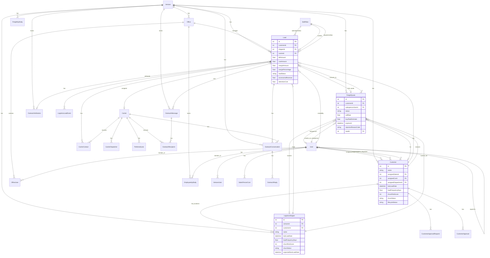
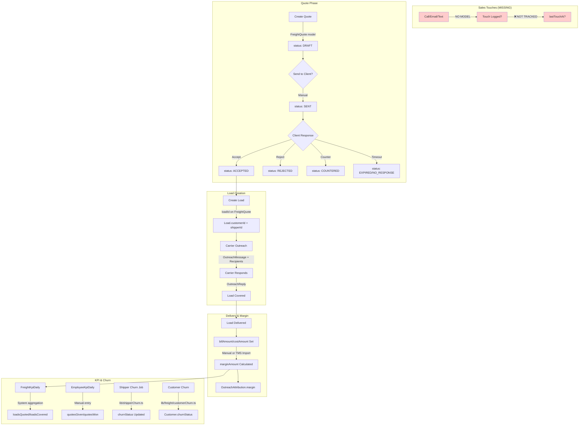
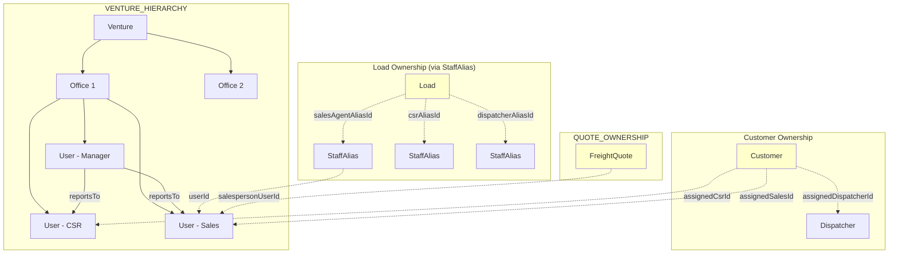

# Freight Sales Engine Audit Report
**Date:** December 13, 2025

---

## SECTION 0 — DIAGRAMS

### 0.1 ERD (Mermaid) - Core Freight/Sales Entities



**Ambiguity Note:** `Customer` vs `LogisticsShipper` - Both track churn metrics. `Customer` = company/account level. `LogisticsShipper` = physical location. Both have `lastLoadDate`, `churnRiskScore`, `churnStatus`. Load has BOTH `customerId` AND `shipperId` - unclear which is canonical.

### 0.2 Funnel Flow Diagram (Mermaid)



**Data Sources:**
- Quote creation: MANUAL via API
- Quote status changes: MANUAL (no auto-expire job found)
- Load creation from quote: MANUAL (loadId linkage exists)
- Margin fields: MANUAL or TMS import (billAmount/costAmount)
- Churn calculations: SYSTEM (lib/shipperChurn.ts, lib/freight/customerChurn.ts)
- KPI reconciliation: NO ENFORCEMENT between EmployeeKpiDaily and FreightKpiDaily

### 0.3 Ownership & Org Diagram (Mermaid)



**Ownership Notes:**
- Customer: Direct FK to User (assignedSalesId, assignedCsrId, assignedDispatcherId) - **ADVISORY ONLY**, not enforced
- Load: Uses StaffAlias bridge table (imported from TMS names) - **NOT DIRECT USER FK**
- Quote: Direct salespersonUserId FK - **ENFORCED**
- Office/Hierarchy: OfficeUser junction + User.reportsTo exists, **but not used in routing logic**

---

## SECTION 1 — EXISTENCE AUDIT

### 1) Sales Activity / Client Touchpoints

**Status: ❌ MISSING**

| Item | Status | Details |
|------|--------|---------|
| SalesActivity model | ❌ Missing | No dedicated model exists |
| Touch/CallLog model | ❌ Missing | Only `BpoCallLog` exists (for BPO, not freight sales) |
| CarrierContact model | ✅ Exists | BUT this is for carrier outreach, not customer/shipper touchpoints |
| lastTouchAt on Customer | ❌ Missing | Field does not exist in schema |
| Touch tied to Customer | ❌ Missing | No touch tracking at customer level |
| Touch tied to Load | ⚠️ Partial | CarrierContact ties to Load, but this is carrier-facing |
| Touch tied to User | ❌ Missing | No sales activity by user tracking |

**Files:**
- `CarrierContact` model: lines 951-968 in schema
- `BpoCallLog` model: lines 1312-1336 (BPO only)

**Key Gap:** No way to track when a CSR/Sales rep last contacted a customer/shipper.

---

### 2) Quotes & Quote Lifecycle

**Status: ✅ EXISTS**

| Item | Status | Details |
|------|--------|---------|
| FreightQuote model | ✅ Exists | First-class model with full lifecycle |
| Status tracking | ✅ Exists | DRAFT, SENT, NO_RESPONSE, REJECTED, COUNTERED, ACCEPTED, BOOKED, EXPIRED |
| Rejection reasons | ✅ Exists | `rejectionReasonCode`, `rejectionReasonText` fields |
| Counter-offer | ✅ Exists | `counterOfferRate` field |
| expiresAt | ✅ Exists | Field exists, set at creation |
| Auto-expire job | ❌ Missing | No cron/background job to auto-expire quotes |

**Files:**
- Model: `prisma/schema.prisma` lines 1168-1206
- Create API: `pages/api/freight/quotes/create.ts`
- Status API: `pages/api/freight/quotes/[id]/status.ts`

**Limitations:**
- No auto-timeout from SENT → EXPIRED
- No notification when quote expires
- Quote tracking in EmployeeKpiDaily (`quotesGiven`, `quotesWon`) is MANUAL entry, not linked to FreightQuote

---

### 3) Quote → Load Attribution

**Status: ⚠️ PARTIAL**

| Item | Status | Details |
|------|--------|---------|
| Quote to Load FK | ✅ Exists | `FreightQuote.loadId` (unique) |
| "Create Load from Quote" flow | ❌ Missing | No API endpoint implements this |
| Attribution enforced | ❌ Missing | loadId is optional, can create loads without quote |
| Win rate calculation | ❌ Missing | No automatic status→BOOKED when load created |

**How it works today:**
- FreightQuote has optional `loadId` field
- No endpoint to convert quote → load automatically
- Manual linkage possible but not enforced

---

### 4) Customer Ownership & Routing

**Status: ⚠️ PARTIAL**

| Item | Status | Details |
|------|--------|---------|
| assignedSalesId | ✅ Exists | FK on Customer model |
| assignedCsrId | ✅ Exists | FK on Customer model |
| assignedDispatcherId | ✅ Exists | FK on Customer model |
| Enforcement | ❌ Missing | Advisory only, no routing logic |
| Unassigned queue | ❌ Missing | No dashboard for unassigned customers |
| Hierarchy rollups | ❌ Missing | reportsTo exists but not used in reporting |

**Files:**
- Customer model: lines 899-943 in schema
- Customer API: `pages/api/logistics/customers/`

---

### 5) Client Touchpoints for "Missing Loads" (CRITICAL)

**Status: ❌ CANNOT ANSWER**

The system CANNOT currently answer: "Which customers have not sent loads in their normal cadence, and have not been touched recently by their assigned CSR/Sales?"

| Required Data | Status |
|---------------|--------|
| lastLoadDate per Customer | ✅ Exists |
| lastLoadDate per LogisticsShipper | ✅ Exists |
| loadFrequencyDays (baseline) | ✅ Exists |
| expectedNextLoadDate | ✅ Exists (on LogisticsShipper only) |
| lastTouchAt per Customer | ❌ MISSING |
| Dashboard for dormant/at-risk | ⚠️ Partial |

**What EXISTS:**
- `pages/freight/shipper-churn.tsx` - Shows churn status by shipper
- `pages/freight/shipper-health/` - ShipperChurnTab.tsx, AtRiskLostTab.tsx
- `lib/shipperChurn.ts` - Calculates churn metrics for LogisticsShipper
- `lib/freight/customerChurn.ts` - Calculates churn for Customer

**What's MISSING:**
- No touch/contact tracking whatsoever
- Cannot correlate "no loads" with "no recent touch"
- No follow-up queue for CSRs

---

### 6) Churn Tracking

**Status: ✅ EXISTS (Load-based only)**

| Item | Status | Details |
|------|--------|---------|
| Customer churn | ✅ Exists | `churnStatus`, `churnRiskScore`, `lastLoadDate` on Customer |
| LogisticsShipper churn | ✅ Exists | Full metrics including `expectedNextLoadDate` |
| Calculation method | ✅ System | `lib/shipperChurn.ts`, `lib/freight/customerChurn.ts` |
| Predictive | ⚠️ Basic | Uses load frequency patterns, not ML |
| Background job | ⚠️ Manual | `updateAllShipperChurnStatuses()` must be called |
| Cron scheduling | ❌ Missing | No automatic scheduled job |

**Files:**
- `lib/shipperChurn.ts` (740+ lines) - Comprehensive shipper churn
- `lib/freight/customerChurn.ts` - Customer-level churn
- `pages/api/freight/shipper-churn/` - API endpoints
- `pages/freight/shipper-churn.tsx` - UI

**Churn Statuses:** ACTIVE, AT_RISK, CHURNED, REACTIVATED, NEW

---

### 7) Margin & Profitability Reporting

**Status: ✅ EXISTS**

#### A) Average margin per load

| Item | Status | Details |
|------|--------|---------|
| Margin stored per load | ✅ Exists | `marginAmount`, `marginPercentage` on Load |
| billAmount/costAmount | ✅ Exists | Fields on Load |
| Aggregation | ✅ Exists | `lib/freight/margins.ts`, P&L API |

#### B) Margin by date range

| Item | Status | Details |
|------|--------|---------|
| Date range selection | ✅ Exists | P&L API accepts startDate/endDate |
| Per Customer | ⚠️ Partial | Data available, grouping possible |
| Per Shipper | ⚠️ Partial | Data available, grouping possible |
| Per Salesperson | ❌ Missing | No direct aggregation (would need StaffAlias join) |

**Files:**
- `pages/api/freight/pnl.ts` - P&L summary with date range
- `pages/freight/pnl.tsx` - UI
- `lib/freight/margins.ts` - Margin calculation helper

**True Margin Components:**
- ✅ accessorialRevenue, fuelRevenue, otherRevenue
- ✅ detentionCost, lumperCost, tollsCost, fuelCost
- ❌ Claims/chargebacks - NOT tracked
- ❌ Booked vs true margin distinction - NOT implemented

---

### 8) KPI Reconciliation (Manual vs System)

**Status: ⚠️ PARTIAL - NO RECONCILIATION**

| Model | Type | Fields |
|-------|------|--------|
| EmployeeKpiDaily | Manual | quotesGiven, quotesWon, loadsTouched, loadsCovered, revenueGenerated |
| FreightKpiDaily | System | loadsQuoted, loadsCovered, totalRevenue, totalProfit |

**Issues:**
- Both track similar metrics independently
- No cross-validation or reconciliation
- Double-counting possible
- No defined "source of truth"

**Files:**
- `lib/kpiFreight.ts` - FreightKpiDaily logic
- `pages/api/employee-kpi/daily.ts` - Manual entry
- `pages/api/freight-kpi/` - System aggregation

---

### 9) Customer Dedupe & Merge

**Status: ⚠️ PARTIAL**

| Item | Status | Details |
|------|--------|---------|
| Dedupe detection | ✅ Exists | `lib/freight/customerDedupe.ts` |
| Dedupe at quote creation | ✅ Exists | Prompts user if duplicates found |
| Merge functionality | ❌ Missing | No merge API/UI |
| Audit trail | ❌ Missing | No merge history tracking |

**Files:**
- `lib/freight/customerDedupe.ts` - Scoring algorithm (TMS code, phone, email, name+state)
- `pages/api/freight/quotes/create.ts` - Uses dedupe, returns `needsConfirmation`

---

### 10) Sales Pipeline Stages (Sales vs Ops)

**Status: ❌ MISSING**

| Item | Status |
|------|--------|
| Sales stages separate from LoadStatus | ❌ Missing |
| Pipeline view for sales teams | ❌ Missing |
| Funnel metrics | ❌ Missing |

**Note:** `Customer.lifecycleStatus` field exists but is just a string with no defined stages or UI.

---

### 11) Office & Hierarchy Reporting

**Status: ⚠️ PARTIAL**

| Item | Status | Details |
|------|--------|---------|
| Metrics by Office | ⚠️ Partial | officeId on loads/KPIs, but no rollup views |
| Manager rollups via reportsTo | ❌ Missing | Field exists, no aggregation logic |
| Team targets/goals | ❌ Missing | No target models |

---

### 12) True Margin Components

**Status: ⚠️ PARTIAL**

| Component | Status |
|-----------|--------|
| Line haul | ✅ lineHaulRevenue, lineHaulCost |
| Fuel | ✅ fuelRevenue, fuelCost |
| Accessorials | ✅ accessorialRevenue |
| Detention | ✅ detentionCost |
| Lumper | ✅ lumperCost |
| Tolls | ✅ tollsCost |
| TONU | ❌ Missing |
| Layover | ❌ Missing |
| Claims | ❌ Missing |
| Chargebacks | ❌ Missing |
| Booked vs True margin | ❌ Not distinguished |

---

## SECTION 2 — FILE INDEX

### UI Screens (Freight/Sales)
```
pages/freight/
├── ai-tools/                    # AI assistants
├── carriers/[id].tsx            # Carrier detail
├── carriers/index.tsx           # Carrier list
├── coverage-war-room.tsx        # Coverage dashboard
├── intelligence.tsx             # Freight intelligence
├── kpi.tsx                      # KPI dashboard
├── loads/[id].tsx               # Load detail
├── loads/index.tsx              # Load list
├── lost-and-at-risk.tsx         # At-risk loads
├── outreach-war-room.tsx        # Carrier outreach
├── pnl.tsx                      # P&L report
├── sales-kpi.tsx                # Sales KPI
├── shipper-churn.tsx            # Churn dashboard
├── shipper-health/              # Health dashboards
│   └── tabs/
│       ├── AtRiskLostTab.tsx
│       ├── ShipperChurnTab.tsx
│       └── ShipperIcpTab.tsx
└── shipper-icp.tsx

pages/logistics/
├── customers/[id].tsx
├── customers/index.tsx
├── shippers/[id].tsx
├── shippers/index.tsx
└── dashboard.tsx
```

### API Routes (Freight/Sales)
```
pages/api/freight/
├── quotes/create.ts             # Quote creation with dedupe
├── quotes/[id]/status.ts        # Quote status update
├── loads/                       # Load CRUD
├── carriers/                    # Carrier management
├── outreach/                    # Carrier outreach
├── pnl.ts                       # P&L summary
├── shipper-churn/               # Churn APIs
├── shipper-icp/                 # ICP analysis
└── at-risk-loads.ts

pages/api/logistics/
├── customers/
├── shippers/
├── customer-approvals/
└── customer-approval-requests.ts
```

### lib/ Services
```
lib/
├── shipperChurn.ts              # Shipper churn calculation (740+ lines)
├── freight/
│   ├── customerChurn.ts         # Customer churn
│   ├── customerDedupe.ts        # Dedupe logic
│   ├── margins.ts               # Margin calculation
│   └── stats.ts                 # Freight stats
├── kpiFreight.ts                # FreightKpiDaily
├── logistics/
│   ├── customerLocation.ts      # Location management
│   └── matching.ts              # Carrier matching
└── outreach/                    # Carrier outreach
```

### Background Jobs
```
lib/jobs/
└── fmcsaAutosyncJob.ts          # FMCSA carrier sync

# NO scheduled churn job found
# NO quote expiration job found
```

---

## SECTION 3 — CURRENT CANONICAL RULES (AS-IS)

### Canonical Identity

**Ambiguous:** Both Customer and LogisticsShipper are treated as identity.

- `Load.customerId` → Company/account level
- `Load.shipperId` → Physical location level
- Both have churn tracking
- Customer owns LogisticsShipper (1:many)

**Current Behavior:**
- TMS imports create LogisticsShipper records
- Quotes link to Customer (required) + optional Shipper
- Loads have BOTH customerId and shipperId
- Churn tracking runs on BOTH independently

### What's Primary Today?
- **Load attribution:** Uses `shipperId` for location, `customerId` for billing
- **Churn calculation:** More detailed on LogisticsShipper (has expectedNextLoadDate)
- **Ownership assignment:** On Customer only (no CSR/Sales on Shipper)

### Normalization/Validation
- ✅ Customer dedupe at quote creation
- ✅ StaffAlias normalization for TMS names
- ❌ No automatic shipper→customer linkage validation

### Background Jobs Running
- FMCSA carrier auto-sync (with FmcsaSyncLog)
- NO churn recalculation cron
- NO quote expiration cron

---

## SECTION 4 — MINIMAL NEXT STEPS

### Top 3 Highest-ROI Gaps to Close

#### 1. Add CustomerTouch Model (Sales Activity Tracking)

**Why it matters:**
- Cannot answer "which dormant customers haven't been contacted"
- No visibility into sales team activity
- Churn detection without touch correlation is incomplete

**Minimal surface-area:**
```prisma
model CustomerTouch {
  id          Int       @id @default(autoincrement())
  customerId  Int
  userId      Int
  channel     String    // CALL, EMAIL, TEXT, MEETING
  outcome     String?
  notes       String?
  createdAt   DateTime  @default(now())
  
  customer    Customer  @relation(fields: [customerId], references: [id])
  user        User      @relation(fields: [userId], references: [id])
}
```

**Reuses:**
- Existing Customer model
- Existing User model
- Pattern from CarrierContact model

**Add:** `lastTouchAt` computed field or stored on Customer

---

#### 2. Quote → Load Conversion Endpoint

**Why it matters:**
- Quote lifecycle is implemented but not connected to load creation
- Win rate calculation impossible without linkage
- Attribution gap between sales and ops

**Minimal surface-area:**
- New API: `POST /api/freight/quotes/[id]/convert-to-load`
- Auto-sets `FreightQuote.loadId` and status to BOOKED
- Creates Load with customerId/shipperId from quote
- Inherits salesperson from quote

**Reuses:**
- FreightQuote.loadId already exists
- Load creation logic exists
- FreightQuote status enum has BOOKED

---

#### 3. Scheduled Churn Recalculation Job

**Why it matters:**
- Churn metrics only update when manually called
- At-risk detection is stale
- No proactive alerts

**Minimal surface-area:**
- Add cron endpoint: `GET /api/jobs/recalculate-churn`
- Call `updateAllShipperChurnStatuses()` and `updateAllCustomerChurnMetrics()`
- Log results to existing ActivityLog

**Reuses:**
- `lib/shipperChurn.ts` (fully implemented)
- `lib/freight/customerChurn.ts` (fully implemented)
- ActivityLog model

---

## "If we build next…"

1. **CustomerTouch model + lastTouchAt** — Enables sales activity tracking and dormant customer detection with CSR correlation. Thin layer, reuses existing patterns.

2. **Quote→Load conversion API** — Closes the attribution gap between sales and ops. Uses existing FreightQuote.loadId field.

3. **Scheduled churn job** — Activates the sophisticated churn logic that already exists in lib/shipperChurn.ts. Zero new models needed.

---

*Audit completed December 13, 2025. Based on actual codebase analysis.*
